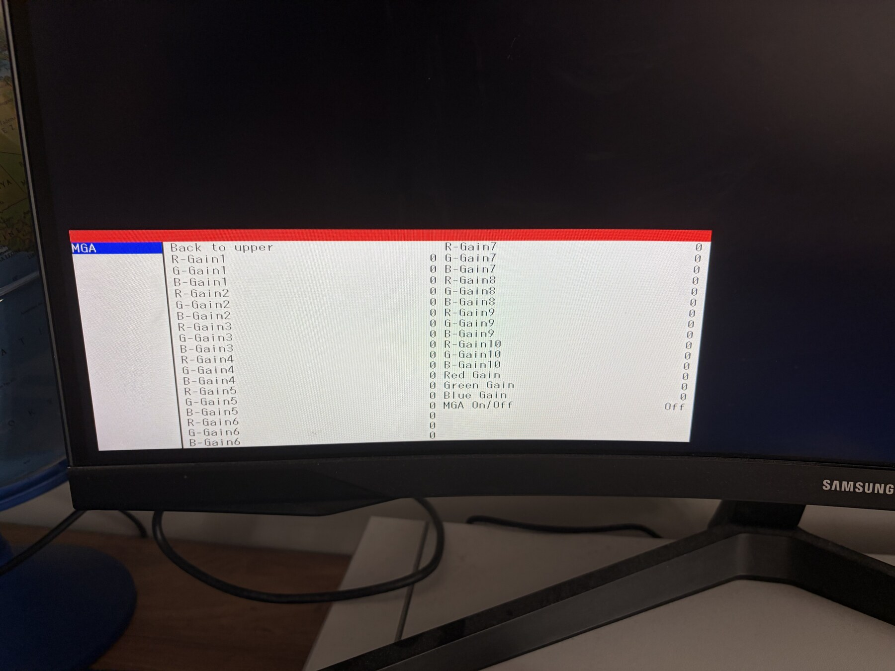

# Samsung Odyssey G5 G55C (LS32CG552EUXUF) firmware research

Reverse engineering notes and reproducible tooling for the 32-inch Samsung
Odyssey G5 G55C, exact model `LS32CG552EUXUF`, running firmware
`M-C5500GGZA-1010.0[D43B]`.

The practical result is deliberately small: a one-byte data flag makes the
existing hidden `MGA` factory-calibration page visible. No executable code,
bootloader, EDID, calibration value, key dispatcher, or flash layout is
changed.

> [!WARNING]
> This is owner-performed hardware research, not an official Samsung update.
> Flashing modified firmware can permanently damage a monitor. The tested
> monitor had USB update access but no external SPI recovery. Read
> [SAFETY.md](SAFETY.md) before reproducing anything.

Türkçe sürüm: [README.tr.md](README.tr.md)



*Hardware result on the tested `LS32CG552EUXUF`: the existing MGA page renders
all 35 rows after the support byte is enabled. The values remain read-only by
design; this project does not make them editable.*

## Public reproducibility boundary

The firmware-independent SPARC research harness is not included in this
release yet. Emulator-derived results are documented with addresses, raw
instructions, inputs, and observed outputs, but only the deterministic image
builder, verifier, and their safety regression tests are currently public.
The emulator is corroborating evidence rather than a substitute for hardware
validation. See [docs/TOOLS.md](docs/TOOLS.md).

## Confirmed findings

- The main application is SPARC V8, 32-bit, big-endian.
- Holding the joystick **UP** opens the existing MGA factory event on the
  tested monitor.
- `MGA / Not supported` is controlled by one category `supported` byte:
  `VA 0x2A4A76`, file offset `0x2D2776`, `00 -> 01`.
- After that byte is enabled, the stock renderer displays 35 existing MGA
  rows.
- The rows remain read-only because their descriptors do not have a valid
  MGA read/write path. This is a firmware limitation, not a missing
  permission flag.
- Changing MGA rows from kind 2/3 to the generic kind-4 byte editor was
  emulated and is unsafe: it writes unrelated persistent configuration
  selectors and truncates the `0x2FE` gain range to eight bits.
- HDMI/DP EQ uses runtime automatic link training. Its flash tables contain
  scan candidates, not a persistent manual EQ value; factory labels 44/45
  have no value/action descriptors.
- The adjacent hidden Factory `Picture` category is real and writable, but its
  visibility byte is shared with the normal OSD. Enabling it made the normal
  Game and Picture categories disappear, so that patch was rejected.
- TCON FW/DATA, FPGA, PDIC, and Panel Timing update entries are strings or
  stubs without a verified handler/payload in this build. They must not be
  exposed as working actions.
- Local Dimming is not a safely unlockable spatial-zone feature on this model;
  the firmware selects a single global PWM backlight path.

## Tested final build

The final tested build was generated from the exact stock input below:

```text
Stock input
  filename: M-C5500GGZA-1010.0[D43B].img
  size:     3,449,760 bytes
  SHA-256:  2e901cf2677b688d740dc62b279faedbee991c726ab5c3dcf75d156115cc96e7
  sum16:    D43B

Generated output
  filename: M-C5500GGZA-1014.0[D440].img
  size:     3,449,760 bytes
  SHA-256:  815f28e8e1eaba498c07cd500d581c63b16a887ea0da274152d1297b8d237350
  sum16:    D440
```

Only two bytes differ from stock:

| File offset | Stock | Final | Purpose |
|---:|---:|---:|---|
| `0x273367` | `30` (`0`) | `34` (`4`) | Embedded version `1010.0 -> 1014.0` |
| `0x2D2776` | `00` | `01` | MGA category `supported` |

The shared Factory Picture/normal-OSD byte at `0x2D278D` remains stock `00`.

The repository intentionally does **not** contain Samsung firmware. Supply
your own legally obtained, byte-identical stock image:

```bash
python3 tools/build_mga_only.py /path/to/M-C5500GGZA-1010.0[D43B].img
python3 tools/verify_mga_only.py \
  /path/to/M-C5500GGZA-1010.0[D43B].img \
  output/M-C5500GGZA-1014.0[D440].img
```

The safety checks do not use Python `assert` statements and remain active
under optimized execution (`python3 -O`). CI tests both normal and optimized
Python modes.

## Documentation

- [Technical map and disassembly evidence](docs/TECHNICAL.md)
- [Revision-specific address ledger](docs/ADDRESS_LEDGER.md)
- [Experiment timeline, failures, and resolutions](docs/INCIDENTS.md)
- [MGA and Factory Picture behavior](docs/MGA_AND_FACTORY_PICTURE.md)
- [Hidden-feature and TCON conclusions](docs/HIDDEN_FEATURES.md)
- [Resolved MGA-write and HDMI/DP-EQ questions](docs/OPEN_QUESTIONS_RESOLVED.md)
- [Tooling and emulator scope](docs/TOOLS.md)
- [Testing and reproducibility](docs/VALIDATION.md)
- [Release checklist](docs/RELEASE_CHECKLIST.md)

## What this project does not claim

- It does not make MGA values editable.
- It does not add a custom menu or inject code.
- It does not unlock TCON/FPGA/PDIC updates.
- It does not prove hardware support from the presence of a string.
- It does not claim that the patch is safe for another firmware revision,
  model code/suffix, panel revision, or checksum. In particular, the 27-inch
  `LS27CG552EUXUF` is not a validated target.

## License and firmware ownership

The scripts and original documentation are MIT licensed. Samsung firmware,
manuals, trademarks, and product assets remain the property of their
respective owners and are not redistributed here.
