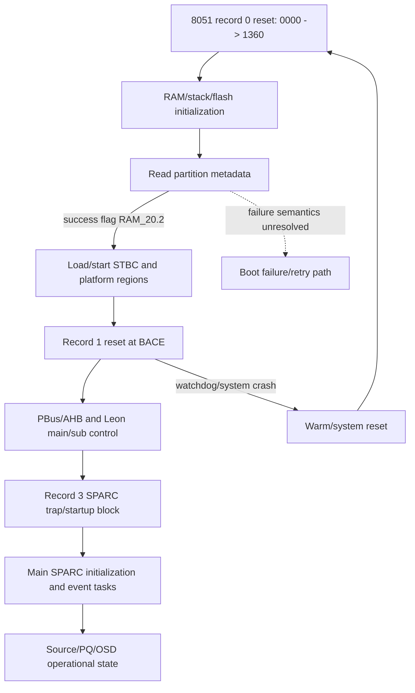
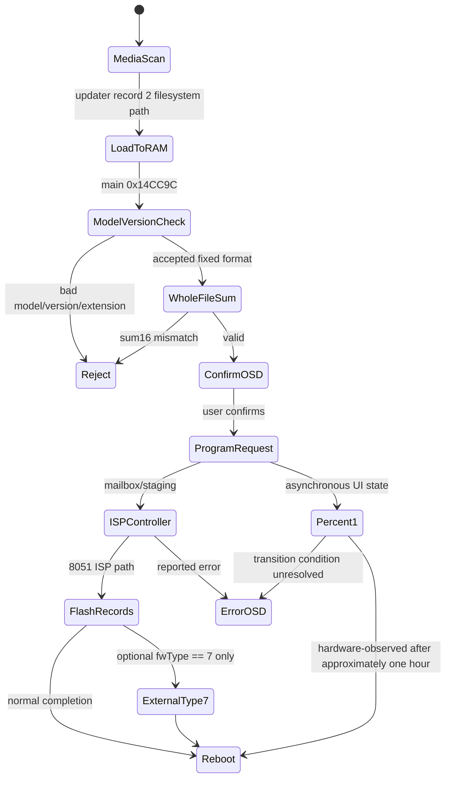
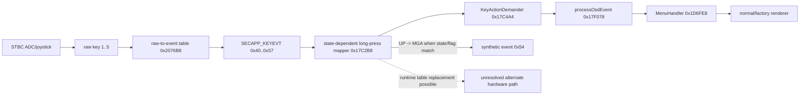
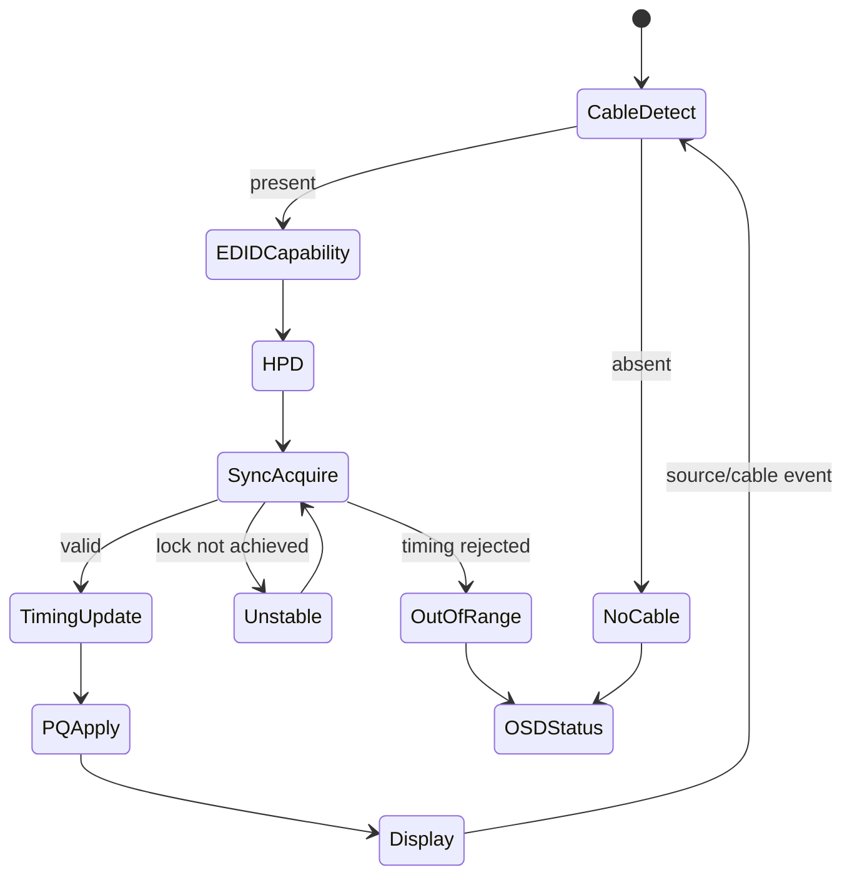
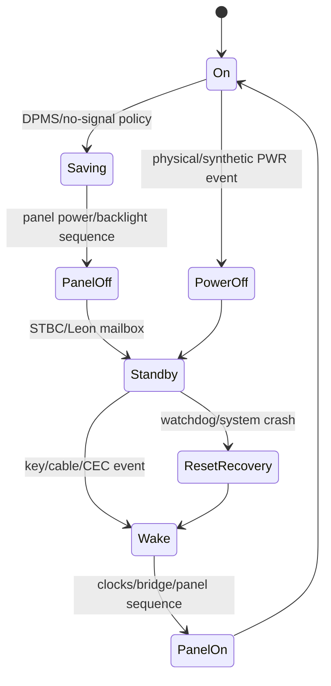
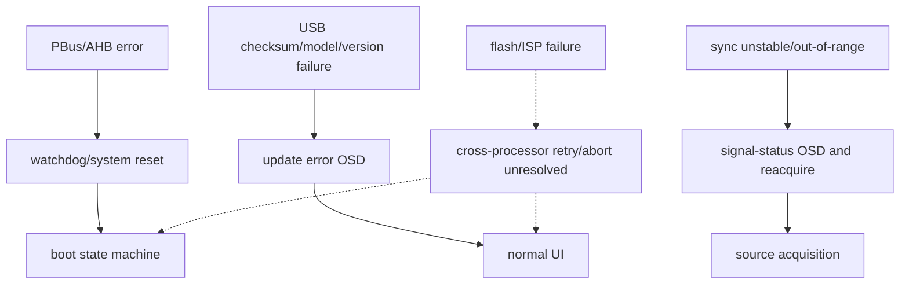

# Recovered state machines

These diagrams contain only observed states/transitions. Dashed edges are
explicitly unresolved runtime, hardware, or cross-processor transitions.

## Boot and processor handoff

Evidence: record-0 reset `0000: ljmp 1360`, partition success return
`0x05A0`, STBC reset `0000: ljmp BACE`, Leon/PBus strings and reachable
calls, record-3 vector targets, main initialization anchors. The exact loader
relocation transaction for records 3/4/8 remains unresolved.

## USB firmware update

The displayed percentage is not proven to be a direct flash-address counter.
No UART/USB trace was captured during the observed one-hour 1% state.

## Input, long press, and OSD

Long-UP opening MGA is hardware-confirmed. The static `0x10` key-dispatch
cell does not alone explain that observation and is retained as an unresolved
alternate path.

## Source switching and signal acquisition

Evidence anchors include `SecHalScaler_SetInputSource 0x1229F8`,
`ToggleHPD 0x11EBCC`, EDID read/write, sync callback `0x123620`, and
application cable/no-signal/unstable/out-of-range events. Exact per-port
debounce timers and every hardware interrupt edge remain unresolved.

## Power and DPMS

Main anchors: panel power `0x117A64`, backlight on/off
`0x117D64/0x117DE4`, DPMS handler `0x17B778`; STBC evidence includes ADC wake,
CEC power, Leon RUN/STOP, watchdog, and warm reset. GPIO numbers and exact
mailbox payload fields are unresolved.

## Factory/MGA

```mermaid
stateDiagram-v2
    [*] --> NormalOSD
    NormalOSD --> SyntheticMGA: long-UP and runtime condition
    SyntheticMGA --> FactoryRenderer: event 0x54
    FactoryRenderer --> NotSupported: descriptor supported == 0
    FactoryRenderer --> MGAList: descriptor supported == 1
    MGAList --> Render35: walk 35 descriptors
    Render35 --> ReadOnlyZero: kind 2/3
    Render35 --> GenericByteEditor: kind 4 only
    GenericByteEditor --> WrongPersistentSelector: forced MGA mutation
    WrongPersistentSelector --> [*]: unsafe; not released
    MGAList --> NormalOSD: Back to upper
```

The released change affects only `supported`; it does not change dispatcher,
item kinds, storage, or apply logic.

## Error recovery

No claim is made that these diagrams recover every source-level state variable.
They are the complete set of currently evidenced high-level machines; missing
edges are explicitly marked rather than inferred.
